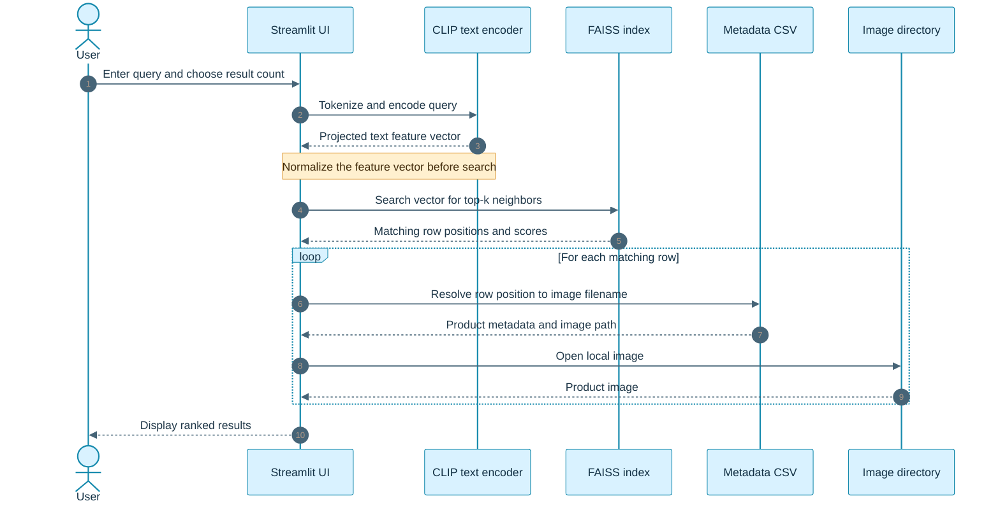
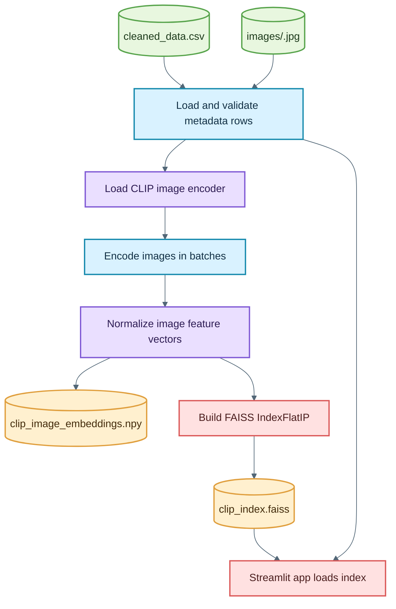

# Semantic Fashion Image Search

A text-to-image fashion search application. Describe an item in natural language, and the app uses CLIP to encode the query, FAISS to retrieve the closest product vectors, and the local product-image collection to display results.

## Contents

- [Overview](#overview)
- [How Search Works](#how-search-works)
- [Project Layout](#project-layout)
- [Data And Artifacts](#data-and-artifacts)
- [Install And Run](#install-and-run)
- [Rebuild The Search Index](#rebuild-the-search-index)
- [Troubleshooting](#troubleshooting)
- [GitHub And Dataset Notes](#github-and-dataset-notes)

## Overview

The project contains a Streamlit user interface and a notebook-based workflow for generating the search index.

| Component | Responsibility |
| --- | --- |
| Streamlit | Accept a text query and number of results; display matching product images. |
| CLIP (`openai/clip-vit-base-patch32`) | Convert text into a 512-dimensional feature vector in the same feature space as the indexed images. |
| FAISS | Search the saved image vectors using inner product; normalized vectors make this equivalent to cosine similarity ranking. |
| Pandas metadata table | Map each result position returned by FAISS to a product row and image filename. |
| Product image directory | Supply the image files shown in the results. |

## System Architecture

```mermaid
%%{init: {"theme":"base","themeVariables":{"primaryColor":"#d9f2ff","primaryTextColor":"#152b3c","primaryBorderColor":"#168aad","lineColor":"#526777","secondaryColor":"#e8f7df","tertiaryColor":"#fff0cf","background":"#ffffff","fontFamily":"Segoe UI, sans-serif"}}}%%
flowchart LR
    visitor([Visitor]) -->|fashion description| ui[Streamlit search interface]
    ui --> processor[CLIP text processor]
    processor --> encoder[CLIP text encoder]
    encoder --> normalize[Normalize query vector]
    normalize --> search[FAISS nearest-neighbor search]

    search -->|row positions| metadata[(cleaned_data.csv)]
    metadata --> imageResolver[Resolve image filename]
    imageResolver --> images[(Local product JPEGs)]
    images -->|ranked product photos| ui

    classDef user fill:#fff0cf,stroke:#e09f3e,color:#422b0b,stroke-width:2px;
    classDef interface fill:#d9f2ff,stroke:#168aad,color:#123044,stroke-width:2px;
    classDef model fill:#eadfff,stroke:#805ad5,color:#2d1c53,stroke-width:2px;
    classDef index fill:#ffe1e1,stroke:#db5a5a,color:#4b1e1e,stroke-width:2px;
    classDef data fill:#e8f7df,stroke:#58a44c,color:#1d3a1b,stroke-width:2px;

    class visitor user;
    class ui interface;
    class processor,encoder,normalize model;
    class search index;
    class metadata,imageResolver,images data;
```



# How Search Works

The application follows a text-to-image retrieval pipeline.

1. The user enters a natural-language fashion description.
2. Streamlit receives the search query.
3. CLIP tokenizes and encodes the text.
4. The query vector is normalized.
5. FAISS searches the image-vector index.
6. FAISS returns the nearest vector positions and similarity scores.
7. The positions are mapped to rows in `cleaned_data.csv`.
8. The corresponding product image filenames are resolved.
9. The local product images are displayed in ranked order.

## Search Request



## Project Layout

```text
.
|-- README.md
|-- requirements.txt
|-- .gitignore
`-- archive (13)/
    |-- app.py
    |-- cleaned_data.csv
    |-- clip_index.faiss
    |-- images/
    |   |-- 10000.jpg
    |   `-- <product-id>.jpg
    |-- styles.csv
    |-- quries.txt
    `-- DSA_FINAL_PROJECT.ipynb
```

The folder name `archive (13)` is part of the current project layout. Commands below quote it because it contains a space and parentheses.

## Data And Artifacts

### Required To Run The App

Keep these files together under `archive (13)`:

| Path | Purpose |
| --- | --- |
| `archive (13)/app.py` | Streamlit application entry point. |
| `archive (13)/cleaned_data.csv` | Product rows. The app uses row order to map FAISS results to images. |
| `archive (13)/clip_index.faiss` | Prebuilt FAISS image-vector index used for retrieval. |
| `archive (13)/images/` | Product JPEGs displayed in search results. Filenames are based on product IDs. |

The app reconstructs each image location from the filename in the CSV and the local `images/` directory. It does not require the original laptop's absolute paths to exist.

### Retained For Rebuilding Or Reference

- `archive (13)/DSA_FINAL_PROJECT.ipynb` documents the CLIP embedding and FAISS index workflow.
- `archive (13)/styles.csv` is the original product metadata source.
- `archive (13)/quries.txt` contains example search prompts.
- `requirements.txt` lists the packages needed by the Streamlit app.

### Generated And Optional Files

The notebook creates `clip_image_embeddings.npy` as an intermediate file before writing `clip_index.faiss`.

The running app does not load `clip_image_embeddings.npy`. It can therefore be omitted from a runtime-only distribution.

The app downloads the CLIP model and processor from Hugging Face on first run and uses the local Hugging Face cache afterward.

Local copies of model weights, tokenizer files, notebook checkpoints, and old ResNet artifacts are not required by the current app.

### Index And Metadata Must Stay Aligned

FAISS returns positions, and the app uses each position with:

```python
df.iloc[position]
```

The CSV row order must therefore match the order used when the FAISS index was built.

If you reorder, filter, or replace the metadata after index creation, rebuild the index before searching. Otherwise, results can point to the wrong product images.

## Index Generation Flow



## Install And Run

### Prerequisites

- Windows, macOS, or Linux.
- Python and `pip`.
- Python 3.12 was used during development.
- Internet access on the first run to download `openai/clip-vit-base-patch32` from Hugging Face.
- The required CSV, FAISS index, and product images listed above.
- A GPU is optional. The app uses CUDA when PyTorch detects it; otherwise, it runs on CPU.

## Windows PowerShell

Run these commands from the repository root:

```powershell
py -m venv .venv
.\.venv\Scripts\Activate.ps1
python -m pip install --upgrade pip
python -m pip install -r requirements.txt
python -m streamlit run "archive (13)/app.py"
```

Open the local URL printed by Streamlit, usually:

```text
http://localhost:8501
```

## macOS Or Linux

Run from the repository root:

```bash
python3 -m venv .venv
source .venv/bin/activate
python -m pip install --upgrade pip
python -m pip install -r requirements.txt
python -m streamlit run "archive (13)/app.py"
```

## Using The Search Page

1. Enter a description such as:
   - `red floral dress`
   - `white sneakers`
   - `navy blue suit`
2. Set the number of results from 5 to 50.
3. Select **Search**.
4. The application displays the nearest matching products.

Results are ranked by similarity in CLIP's shared image/text embedding space.

The app displays product images when their files are present in `images/`.

## Rebuild The Search Index

Rebuilding is optional when the included CSV and index are already available.

It can take substantial time and compute, especially on CPU.

### Steps

1. Ensure `cleaned_data.csv` and all referenced images are present.
2. Open `archive (13)/DSA_FINAL_PROJECT.ipynb` in Jupyter or VS Code.
3. Run the dependency-install cell.
4. Execute the notebook cells in order.
5. The notebook creates `clip_image_embeddings.npy`.
6. The notebook writes a new `clip_index.faiss`.
7. Restart or rerun Streamlit so it loads the rebuilt index.

The notebook uses batches of 64 by default.

Reduce `BATCH_SIZE` in the configuration cell if GPU memory is limited.

The notebook's interactive search example also uses `ipywidgets`. Install `ipywidgets` in the notebook environment if that example reports a missing package.

The notebook regenerates the CLIP image index. It does not regenerate `cleaned_data.csv` from `styles.csv`.

If the cleaned CSV must be rebuilt from raw metadata, repeat the project's data-cleaning step and ensure it writes image paths or IDs compatible with the local `images/` directory before building embeddings.

## Troubleshooting

| Symptom | Likely Cause | Action |
| --- | --- | --- |
| `FileNotFoundError` for `cleaned_data.csv` or `clip_index.faiss` | The file is missing or not inside `archive (13)`. | Restore the required file to the documented folder. |
| Results appear but product photos are missing | The image file is absent or its filename does not match the product ID in the CSV. | Check that `images/<product-id>.jpg` exists. |
| `ModuleNotFoundError` | Dependencies were installed into a different Python environment. | Activate `.venv`, then run `python -m pip install -r requirements.txt`. |
| Hugging Face download or connection error | The model is not cached and the machine cannot reach Hugging Face. | Restore network access or configure Transformers to use a valid local model cache. |
| App starts slowly | CLIP is loading for the first time, or inference is running on CPU. | Allow the model download/load to finish. |
| FAISS returns unrelated or mismatched product rows | The metadata was reordered or changed after the index was built. | Rebuild the index from the current CSV in its current row order. |
| Notebook reports missing `ipywidgets` | Notebook-only widget dependency is missing. | Install `ipywidgets` in the active notebook environment. |

## GitHub And Dataset Notes

The full `images/` directory and generated model/index data can be very large.

Do not commit large binary files to ordinary Git history without first choosing an appropriate distribution strategy.

Possible approaches include:

- Git LFS
- GitHub Releases
- An external artifact or dataset store
- A separate dataset download
- A source-only GitHub repository with setup instructions

GitHub rejects individual Git files larger than 100 MB.

The following generated files should generally not be committed to ordinary Git history:

```text
*.npy
*.faiss
*.bin
```

The large dataset image directory can also be excluded when the images are distributed separately:

```text
archive (13)/images/
```

If these files are excluded, the README should explain where users can obtain the required dataset and model/index artifacts.

A clone that does not receive `cleaned_data.csv`, `clip_index.faiss`, and the matching `images/` directory cannot run the full local search.

### Important Git Note

Removing a large file from the current working tree does not remove copies that already exist in earlier Git commits.

If large files have already been committed locally, the Git history must be cleaned before pushing to GitHub.

For a new repository where the remote has not accepted the existing history, recreating the local Git history with the large files excluded is one possible approach.

### Dataset Licensing

Before redistributing the product images or metadata, verify that their source license permits redistribution.

Keep the original source and attribution details with the project where required.

## Project Features

- Natural-language fashion search
- CLIP-based text and image embeddings
- FAISS similarity search
- Streamlit web interface
- Ranked product results
- Local product image retrieval
- Notebook-based index generation
- Configurable number of search results

## Example Queries

Try queries such as:

```text
red floral dress
```

```text
white casual sneakers
```

```text
blue denim jacket
```

```text
black formal shoes
```

```text
women's summer dress
```

```text
men's navy blue shirt
```

## Technologies Used

- Python
- Streamlit
- PyTorch
- Hugging Face Transformers
- CLIP
- FAISS
- Pandas
- NumPy
- Jupyter Notebook

## Conclusion

Semantic Fashion Image Search combines natural-language understanding with vector similarity search to retrieve visually relevant fashion products.

The application uses CLIP to represent the user's text query in the same embedding space as the indexed product images. FAISS then performs efficient nearest-neighbor search, while the metadata CSV maps the retrieved positions back to product information and image files.

The result is a simple natural-language interface for searching a large local fashion image collection.
